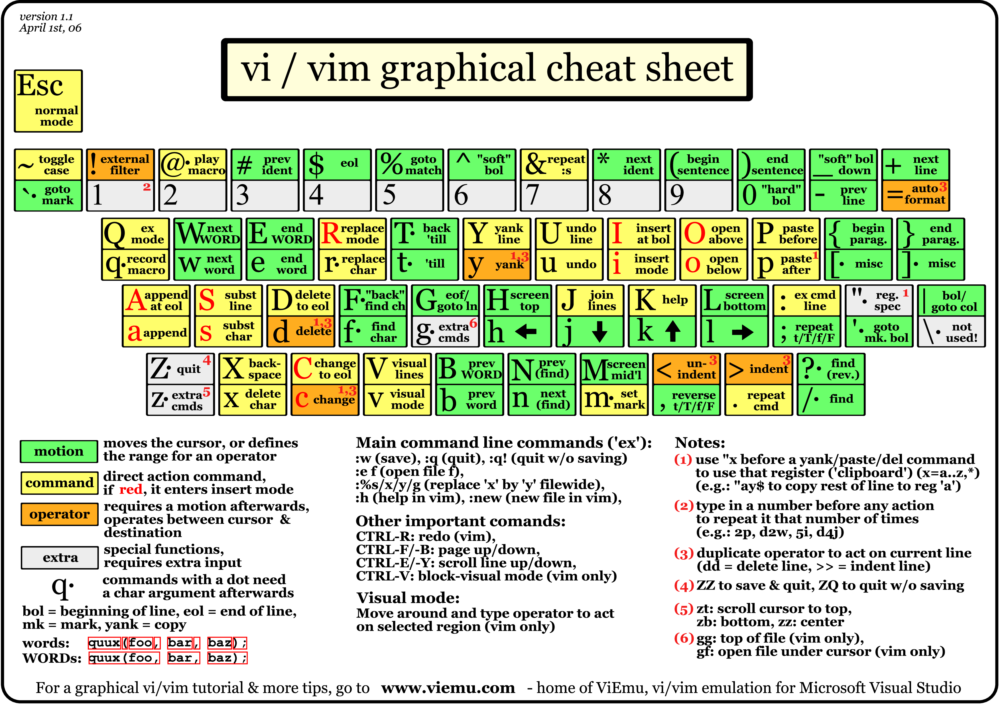

Workshop: Practical Efficient Vim
=================================

You've used Vim for a little while, and maybe even used it to write and edit code.

You know that Vim is supposed to make you super-efficient at editing text and code,
but you feel like you're spending a lot of time fighting Vim to make it do what you want.

Let's get better at Vim together!

**Prerequisites:** vimtutor.
In vimtutor you learn about a lot of basic commands that are useful when editing text,
and I am not going to spend too much time going over the basic commands.

**Optional prerequisites:** LaTeX compiler and Python 3 interpreter.
Some of the exercises involve LaTeX and Python code,
which is more fun if you can compile or run the code after editing it.

I'd recommend that you go through vimtutor (type `vimtutor` in your terminal)
before the workshop to freshen up the following commands:

* <kbd>i</kbd> <kbd>A</kbd> <kbd>o</kbd> <kbd>a</kbd> <kbd>A</kbd>
* <kbd>x</kbd>
* <kbd>:q!</kbd> <kbd>:wq</kbd>
* <kbd>h</kbd> <kbd>j</kbd> <kbd>k</kbd> <kbd>l</kbd>

* <kbd>w</kbd> <kbd>e</kbd> <kbd>0</kbd> <kbd>$</kbd>
* <kbd>dw</kbd> <kbd>d$</kbd> <kbd>dd</kbd>
* <kbd>2w</kbd> <kbd>d2w</kbd> <kbd>2dd</kbd>
* <kbd>u</kbd> <kbd>CTRL-R</kbd>

* <kbd>p</kbd>
* <kbd>r</kbd> <kbd>ce</kbd> <kbd>c$</kbd>

* <kbd>gg</kbd> <kbd>G</kbd> <kbd>CTRL-G</kbd>
* <kbd>/</kbd> <kbd>?</kbd> <kbd>n</kbd> <kbd>N</kbd>
* <kbd>CTRL-O</kbd> <kbd>CTRL-I</kbd>
* <kbd>%</kbd>
* <kbd>:%s/old/new/g</kbd>

* <kbd>:!ls</kbd> <kbd>:r</kbd>
* <kbd>:w</kbd>

* <kbd>R</kbd> <kbd>vy</kbd> <kbd>yw</kbd> <kbd>p</kbd>
* <kbd>:set hls</kbd> <kbd>:set nohls</kbd>

Here's a useful cheatsheet from [viemu.com](http://www.viemu.com/a_vi_vim_graphical_cheat_sheet_tutorial.html):




Lesson zero: Choice of keyboard layout
--------------------------------------

If you're working with LaTeX or any kind of programming,
and you don't use the US keyboard layout (shown in the cheatsheet above),
I strongly recommend that you give it a try!

On the US keyboard layout, you get a lot of useful special characters
without having to hold down Shift, Ctrl or Alt:

* <kbd>&#92;</kbd>
* <kbd>[</kbd> <kbd>]</kbd>
* <kbd>'</kbd>
* <kbd>;</kbd>
* <kbd>/</kbd>
* <kbd>=</kbd>

And with just the Shift key you get the following:

* <kbd>|</kbd>
* <kbd>{</kbd> <kbd>}</kbd>
* <kbd>"</kbd>
* <kbd>:</kbd>
* <kbd>?</kbd>
* <kbd>+</kbd>
* <kbd>~</kbd>

This is a lot better than e.g. Danish keyboard layout
where you need the nasty AltGr key to access <kbd>&#92;</kbd> <kbd>{</kbd> <kbd>}</kbd> <kbd>|</kbd> <kbd>~</kbd>.

For entering special characters such as æ ø å ä ö ü etc.,
you can configure a so-called *Compose key* in Linux
so that you can enter e.g. æ by typing <kbd>Compose</kbd> <kbd>a</kbd> <kbd>e</kbd>.


Lesson one: Getting tabular
---------------------------

**Tip: Press <kbd>"+p</kbd> to paste text into Vim that you copied from outside Vim.**

Here's a small LaTeX document.
Copy it into Vim by selecting it in your web browser, pressing <kbd>CTRL-C</kbd>,
opening Vim, and typing <kbd>"+p</kbd>.

```
\documentclass{memoir}
\usepackage[utf8]{inputenc}
\begin{document}
I år består festudvalget af følgende FU'er:\par
\begin{tabular}{lll}
\hline
Navn & Menneskenavn & Email \\
\hline

\hline
\end{tabular}
\end{document}
```

**Tip: Press <kbd>:w (FILENAME)</kbd> to save a new file.**

Next, type <kbd>:w fu.tex</kbd> to save the document.
Optionally compile it with pdflatex.

Go to <https://TAAGEKAMMERET.dk/bestfu/> in your web browser,
scroll to the bottom and copy the table with ten rows.

**Tip: Press <kbd>}</kbd> to go to the next blank line. Press <kbd>{</kbd> to go to the previous blank line.**

In `fu.tex`, press <kbd>}</kbd> to navigate to the blank line
and paste the copied table with <kbd>"+p</kbd>.

You should obtain something like:

```
\documentclass{memoir}
\usepackage[utf8]{inputenc}
\begin{document}
I år består festudvalget af følgende FU'er:\par
\begin{tabular}{lll}
\hline
Navn & Menneskenavn & Email \\
\hline
FUNA 	Znguvnf Xnaartnneq Avryfra 	SHNA@TAAGEKAMMERET.dk
FURN 	Yvaarn Frurfgrq Fxnsgr 	SHRN@TAAGEKAMMERET.dk
FURF 	Wraf Gebyyr 	SHRF@TAAGEKAMMERET.dk
FUSB 	Zbegra Uhyoæx Sbt 	SHSB@TAAGEKAMMERET.dk
FUVO 	Fbsvr Orueznaa 	SHVO@TAAGEKAMMERET.dk
FUAØ 	Xngevar Uøubyg Xnfcrefra 	SHABR@TAAGEKAMMERET.dk
FUEN 	Znevn Nfxubyz Avryfra 	SHEN@TAAGEKAMMERET.dk
FUEB 	Serqrevx Naqrefra 	SHEB@TAAGEKAMMERET.dk
FUHS 	Nyoreg Serhq Novyqtnneq 	SHHS@TAAGEKAMMERET.dk
FULB 	Znwn Qloobr 	SHLB@TAAGEKAMMERET.dk
\hline
\end{tabular}
\end{document}
```

That's not a proper LaTeX table. Let's do something about that.

**Tip: Press <kbd>f(TAB)</kbd> to jump to the next TAB character.** (works with any single character; tab is simply an example)

**Tip: Press <kbd>s</kbd> to delete a character and go to insert mode.**

**Tip: Press <kbd>;</kbd> to repeat the last <kbd>f</kbd> command.**

**Tip: Press <kbd>.</kbd> to repeat the last text manipulation command.**

Navigate to the first line you inserted and type <kbd>f</kbd><kbd>(TAB)</kbd><kbd>s</kbd><kbd>&amp;(SPACE)(ESC)</kbd><kbd>;</kbd><kbd>.</kbd><kbd>A</kbd><kbd>(SPACE)\\(ESC)</kbd>

That was quick! But we still have 9 more lines to go. You could press <kbd>(RETURN)</kbd> to go to the beginning of the next line and repeat the above key presses, but that would be tedious.

**Tip: Press <kbd>q(LETTER)</kbd> to record a series of keystrokes. End the recording with <kbd>q</kbd>.** This is known as *recording a macro*.

**Tip: Press <kbd>@(LETTER)</kbd> to execute a series of keystrokes. Press <kbd>@@</kbd> to re-execute the last executed series.** This is known as *replaying a macro*.

Go to the beginning of the next line, press <kbd>qq</kbd>, redo the keystrokes you entered for the first line, go to the beginning of the next (i.e. third) line, and press <kbd>q</kbd>.

Now press <kbd>@q</kbd>. If all went well, this should redo for the third line what you did for the second line, and put your cursor at the beginning of the fourth line. If something doesn't look right, maybe you didn't record the macro completely right; try recording it again.

Now press <kbd>7@@</kbd> to run the macro seven more times.

In this case, we knew there are 10 lines in total, so it was easy to calculate the correct number of repeats in our head (i.e. 7).

However, sometimes there's a lot of lines, more than we can quickly count.
For these cases there's another way to run a macro on a set of lines.

Press <kbd>u</kbd> to undo what you did.

**Tip: Press <kbd>V</kbd> to start selecting lines.** This is known as *Visual Line* mode.

**Tip: Press <kbd>:norm @q</kbd> while in Visual Line mode to replay macro <kbd>q</kbd> on the selected lines.**
Note that Vim inserts `'<,'>` in-between `:` and `norm`; this is intended, so don't delete it!

Move the cursor to the first line that needs to be processed, press <kbd>V</kbd>,
move the cursor to the last line, and press <kbd>:norm @q</kbd>.
If all went well, this should replay the macro on each selected line -- no line counting needed on your part!

In this case, the lines that we needed to run the macro on were contiguous.
Sometimes, we want to run a macro on all lines that match a specific pattern instead.

**Tip: Press <kbd>:g/(PATTERN)/norm @q</kbd> to replay macro <kbd>q</kbd> on all lines that contain `(PATTERN)`.**

Undo the previous macro replays with <kbd>u</kbd>.
This time, without going into Visual Line mode,
press <kbd>:g/(TAB)/norm @q</kbd>.
Vim should display the tab character as `^I` - this is intended and is simply the way Vim displays tab characters.
If all went well, this should replay the macro on every line that contains a tab character.

You should now have a file containing something like:

```
\documentclass{memoir}
\usepackage[utf8]{inputenc}
\begin{document}
I år består festudvalget af følgende FU'er:\par
\begin{tabular}{lll}
\hline
Navn & Menneskenavn & Email \\
\hline
FUNA & Znguvnf Xnaartnneq Avryfra & SHNA@TAAGEKAMMERET.dk \\
FURN & Yvaarn Frurfgrq Fxnsgr & SHRN@TAAGEKAMMERET.dk \\
FURF & Wraf Gebyyr & SHRF@TAAGEKAMMERET.dk \\
FUSB & Zbegra Uhyoæx Sbt & SHSB@TAAGEKAMMERET.dk \\
FUVO & Fbsvr Orueznaa & SHVO@TAAGEKAMMERET.dk \\
FUAØ & Xngevar Uøubyg Xnfcrefra & SHABR@TAAGEKAMMERET.dk \\
FUEN & Znevn Nfxubyz Avryfra & SHEN@TAAGEKAMMERET.dk \\
FUEB & Serqrevx Naqrefra & SHEB@TAAGEKAMMERET.dk \\
FUHS & Nyoreg Serhq Novyqtnneq & SHHS@TAAGEKAMMERET.dk \\
FULB & Znwn Qloobr & SHLB@TAAGEKAMMERET.dk \\
\hline
\end{tabular}
\end{document}
```

**Exercise:** Add `\newcommand{\furow}[3]{#1 & #2 & #3 \\}`
and use what you have learned to convert each row
into an invocation of the `\furow` LaTeX command.

Lesson two: Parselmouth
-----------------------

Copy the following Python code and save it as `fu.py`:

```
import re
import urllib.request

with urllib.request.urlopen('https://TAAGEKAMMERET.dk/bestfu/') as request:
    html = request.read().decode('utf-8')

for row in re.finditer('<tr>.*?</tr>', html, re.S):
    name, human_name = re.findall(r'<td>(.*?)</td>', row.group())
    if not name.startswith('FU'):
        continue
    email, = re.findall('mailto:([^"]*)', row.group())
    print('%s & %s & %s \\\\' % (name, human_name, email))
```

**[Aside:** Press <kbd>:filetype</kbd> to see your current filetype settings.
Vim should respond with `filetype detection:ON  plugin:ON  indent:ON`.
If it does not, you need to add `filetype indent plugin on` to the file `~/.vimrc`.
This ensures that Vim automatically indents e.g. Python code correctly.
Close Vim and reopen fu.py after editing your vimrc file.
**---End aside]**

**Tip: Press <kbd>CTRL-P</kbd> while in Insert mode to complete the word at the cursor using other words in the current file.**

Navigate to the `for`-line and press <kbd>O</kbd>
to open a new line above, type <kbd>print("TA</kbd><kbd>CTRL-P</kbd><kbd>s FUer:")</kbd>.
This should yield the line `print("TAAGEKAMMERETs FUer:")`.

**Tip: While completing in Insert mode, use <kbd>CTRL-N</kbd> and <kbd>CTRL-P</kbd>
to navigate the suggestions.
When you are satisfied with the completed word,
press <kbd>(ESCAPE)</kbd> or continue typing to close the completion popup.**

**Tip: Press <kbd>CTRL-X</kbd><kbd>CTRL-L</kbd> while in Insert mode
to complete the line at the cursor using other lines in the current file.**

**Tip: Press <kbd>CTRL-W</kbd> while in Insert mode
to erase the last word you inserted.**

Go to the second `import`-line and press <kbd>o</kbd>
to open a new line above and type
<kbd>im</kbd><kbd>CTRL-X</kbd><kbd>CTRL-L</kbd><kbd>CTRL-W</kbd><kbd>parse</kbd>.
This should yield the line `import urllib.parse`. Delete it again with <kbd>dd</kbd>.

Remember to use these two completion commands (token completion and line completion)
-- they will save you **a lot** of typing in the long run!

But now for something more interesting: *code refactoring*.

The `with`-line is a bit long, don't you think?
We should extract the URL as a variable, i.e. change it to this:

```
url = 'https://TAAGEKAMMERET.dk/bestfu/'
with urllib.request.urlopen(url) as request:
    html = request.read().decode('utf-8')
```

**Tip: Press <kbd>ci(</kbd> to delete the <kbd>i</kbd>nsides of a set of parentheses and switch to Insert mode.**

**Tip: Press <kbd>O</kbd> to <kbd>O</kbd>pen a line above the current line.**

**Tip: Press <kbd>CTRL-A</kbd> while in Insert mode to insert the same text as you inserted the last time you were in Insert mode.**

**Tip: Press <kbd>p</kbd> to put the text you last deleted.**

Here's how I would do it:

1. Navigate to the `(` character in the `with`-line -- remember the <kbd>f(</kbd> command?
2. Press <kbd>ci(</kbd><kbd>url</kbd><kbd>(ESCAPE)</kbd> to replace the contents of the parentheses with the variable name `url`
3. Press <kbd>O</kbd><kbd>CTRL-A</kbd><kbd>(SPACE)=(SPACE)</kbd><kbd>(ESCAPE)</kbd> to insert `url = `.
4. Press <kbd>p</kbd> to insert the URL you deleted using in step 2.

**Exercise:** Record step 3 and 4 in a macro to save you a couple keystrokes in the rest of this lesson.

**Tip: Press <kbd>ct,</kbd> to delete everything <kbd>t</kbd>ill the next comma.**

Let's use a macro to extract some more variables in this Python program.

Navigate to the first `'` in the `for`-line with <kbd>f'</kbd>.
Then use <kbd>ct,</kbd> to delete the first argument (i.e. `'<tr>.*?</tr>'`)
and type <kbd>pattern</kbd><kbd>(ESCAPE)</kbd>.

Then repeat steps 3 and 4 above (or replay the macro you just recorded).

**Tip: Press <kbd>c%</kbd> to delete everything from the cursor until the
parenthesis matching the first parenthesis to the right.**

The motion <kbd>%</kbd> moves the cursor to the parenthesis matching the one under the cursor.
However, if there is no parenthesis under the cursor, Vim first searches to the right
in the line for the first open or close parenthesis, and then moves to the matching one.

This is very useful when you want to affect a function call such as
`re.findall(r'<td>(.*?)</td>', row.group())`:
First move the cursor to the "r" in "re.findall", and then press <kbd>%</kbd>
to jump to the end of the function call.

**Exercise:** Extract `mo.group()` to a variable using <kbd>c%</kbd> and your macro.

**Tip: Press <kbd>:nnoremap (COMMAND) (COMMANDS)</kbd> to remap (COMMAND) to (COMMANDS).**

If you like this trick, create a mapping for it!
Personally, I use <kbd>&#92;</kbd><kbd>r</kbd> as a shortcut for steps 3 and 4.
Press <kbd>:nnoremap &#92;r O&lt;C-A&gt; = &lt;Esc&gt;p</kbd>, and then try replacing some argument with a variable name and pressing <kbd>&#92;r</kbd>.

**Tip: Press <kbd>:nnoremap &lt;buffer&gt; (COMMAND) (COMMANDS)</kbd> to create a mapping that only applies in the current file.**

**Put <kbd>au FileType python (COMMAND)</kbd> in your vimrc to run a command whenever you open a Python file.**

If you want to use this trick in all Python files, add the following to your `~/.vimrc`:

```
au FileType python noremap <buffer> \r O<C-A> = <Esc>p
```

Of course, this works for languages other than Python too.
If you're unsure what to put after `au FileType` for a given type of file,
open a file of the given type and type <kbd>:set ft</kbd>,
and Vim will respond with the filetype of the currently-open file.

**Exercise:** Create a mapping for <kbd>&#92;r</kbd> in your vimrc that works for LaTeX instead of Python.
I.e. when you replace `M_{\odot}` with `\sunmass` in a LaTeX file and press <kbd>&#92;r</kbd>,
Vim should insert `\newcommand{\sunmass}{M_{\odot}}` on a new line above.


Lesson three: Spell-checking
----------------------------

**Tip: <kbd>:set spell spelllang=en&#95;us</kbd> to enable American English spell-checking for the current file.**

**Tip: <kbd>:set spellfile=(SPELLFILE)</kbd> to use the extra words in (SPELLFILE) when spell-checking.**

**Tip: <kbd>]s</kbd> and <kbd>[s</kbd> navigate to the next and previous misspelled word in the open file.**

**Tip: <kbd>zg</kbd> saves the word under the cursor as "good" in (SPELLFILE). <kbd>zw</kbd> saves it as "wrong" in (SPELLFILE). <kbd>zuw</kbd> and <kbd>zug</kbd> are used to <kbd>u</kbd>ndo <kbd>zg</kbd> and <kbd>zw</kbd>.**

**Tip: <kbd>au BufRead (PATH)/&#42;.tex (COMMAND)</kbd> to run (COMMAND) whenever you open a .tex-file inside (PATH).**

**Tip: Add <kbd>let g:tex&#95;comment&#95;nospell=1</kbd> in your vimrc to disable spell-checking inside LaTeX comments.**

In my vimrc, I have the following lines to enable spell-checking for my thesis:

```
let g:tex_comment_nospell=1
au BufRead /home/rav/work/thesis/*.tex
	\ setlocal spell spelllang=en_us spellfile=
	\/home/rav/work/thesis/spell.txt.utf8.add
```


Lesson four: Creating and editing multiple files
------------------------------------------------

If you go to <https://TAAGEKAMMERET.dk/galleri/2018>,
you will see a list of albums for the year 2018/19,
named "BEST", "KBEST-perioden", "FU", "GF", and so on.
If you replace "2018" in the URL with a previous year, you'll get a list of that year's albums.

For the next exercise we'll retrieve the list of album names for multiple years.

**Tip: If you tell Vim to open a webpage instead of a filename, Vim will download and display the HTML source code of that page.**

Open the page's source code in Vim by typing <kbd>:e https://TAAGEKAMMERET.dk/galleri/2018</kbd>.

It's a long page, full of hard-to-decipher HTML code.
However, we can still use a couple of Vim tricks to boil it down to just the list of album names we're interested in.

**Tip: Press <kbd>/(PATTERN)</kbd> to search in the open file. Press <kbd>n</kbd> and <kbd>N</kbd> to move to the next or previous search result.**

Try searching the file for the string "KBEST-perioden" by typing <kbd>/KBEST-perioden</kbd>.
You should end up at the following part of the file:

```
<div class="col-xs-6 col-sm-4 col-md-3">
  <a class="thumbnail" href="/galleri/2018/kbest-perioden">
    <div class="thumbcap">
      
	
      
      <div class="caption">
	<h5>KBEST-perioden
	  <small>53 billeder</small>
	</h5>
      </div>
    </div>
  </a>
</div> <!-- col-xs-6 thumb -->
```

Notice that the album name is shown next to the code `<h5>`.
Now we might guess that all the album names will be lines that contain `<h5>`.

**Tip: Press <kbd>:v/(PATTERN)/d</kbd> to delete all lines that do not contain `(PATTERN)`.**

Type <kbd>:v/&lt;h5&gt;/d</kbd> to keep only the lines containing `<h5>`.
If you scroll through the resulting text, you should find that all the lines that remain
correspond exactly to the album names!

**Exercise:** Record a macro where you press <kbd>0</kbd> to move to the beginning of the line and <kbd>df&gt;</kbd> to delete everything until and including the `>` in `<h5>`. Replay the macro on all lines in the buffer.

**Tip: Press <kbd>:sav (FILENAME)</kbd> to save the current file under a new name.**

There is a subtle difference between using <kbd>:w (FILENAME)</kbd>
and <kbd>:sav (FILENAME)</kbd> to save a file.
If you're currently editing a saved file, say foo.txt,
and you press <kbd>:w bar.txt</kbd>,
then Vim will write the contents to bar.txt, but you will still be editing foo.txt.
You need to press <kbd>:sav bar.txt</kbd>
to write the contents to bar.txt *and* switch to bar.txt.

Press <kbd>:sav 2018.tex</kbd> to save the contents to 2018.tex.
It might not look like LaTeX code right now, but don't worry, we will fix that later.

Next, switch to a new file names links.txt by pressing <kbd>:e links.txt</kbd>.
Insert the URL from before in the new file: `https://TAAGEKAMMERET.dk/galleri/2018`

**Tip: Press <kbd>CTRL-X</kbd> to decrease the number under the cursor by one.**
If there is no number under the cursor, Vim will search to the right in the current line for the first number it can find.

Press <kbd>0</kbd> to move to the beginning of the line and <kbd>CTRL-X</kbd> to decrease the year in the URL by one.

Next, press <kbd>yyp</kbd> to make a copy of the line and press <kbd>CTRL-X</kbd> to decrease the year once more.

Repeat the process until you have, let's say, 6 URLs. Your file should contain the contents:

```
https://TAAGEKAMMERET.dk/galleri/2017
https://TAAGEKAMMERET.dk/galleri/2016
https://TAAGEKAMMERET.dk/galleri/2015
https://TAAGEKAMMERET.dk/galleri/2014
https://TAAGEKAMMERET.dk/galleri/2013
https://TAAGEKAMMERET.dk/galleri/2012
```

**Tip: Press <kbd>CTRL-W</kbd><kbd>s</kbd> to <kbd>s</kbd>plit the view of the current file into two.**

**Tip: Press <kbd>CTRL-W</kbd><kbd>CTRL-W</kbd> to move the cursor to the next split.**

**Tip: Press <kbd>CTRL-W</kbd><kbd>c</kbd> to <kbd>c</kbd>lose the split that the cursor is currently in.**

**Tip: Press <kbd>CTRL-W</kbd><kbd>o</kbd> to make the split that the cursor is currently in the <kbd>o</kbd>nly split, that is, close all other splits.**

**Exercise:** Try splitting the current file, moving between the splits, make some edits in one split and see them reflected in the other, undo your edits, and close the splits again.

**Tip: Press <kbd>gf</kbd> to <kbd>g</kbd>o to the <kbd>f</kbd>ile under the cursor.**

Split the current file with <kbd>CTRL-W</kbd><kbd>s</kbd>, move to the top line in the file with <kbd>gg</kbd> and press <kbd>gf</kbd> to open the URL under the cursor.

Repeat the steps you took to create 2018.tex, but don't save the file as 2017.tex just yet.

**Tip: Press <kbd>yiw</kbd> to <kbd>y</kbd>ank (i.e. copy) the <kbd>w</kbd>ord under the cursor.**

Move the cursor to the split containing links.txt by pressing <kbd>CTRL-W CTRL-W</kbd>, and press <kbd>$</kbd><kbd>yiw</kbd> to move the cursor to the end of the line and yank `2017`.
If you press <kbd>p</kbd> anywhere now, you can verify that `2017` has been copied successfully.

Move back to the split containing the album names of 2017.

**Tip: Press <kbd>CTRL-R</kbd><kbd>"</kbd> while editing the command-line at the bottom of the screen to put the text you last yanked or deleted.**
This inserts the same text as would be inserted with <kbd>p</kbd> in Normal mode.

Press <kbd>:sav (CTRL-R)".tex</kbd> to save the file as `2017.tex`. When you press <kbd>CTRL-R</kbd>, Vim should display a `"` character without moving the cursor to the right. Then when you press <kbd>"</kbd>, the copied text `2017` should appear.

Close the split with <kbd>CTRL-W</kbd><kbd>c</kbd> and delete the 2017-link with <kbd>dd</kbd>.

**Exercise (hard):** Repeat the above steps to create `2016.tex`, only this time recording the steps into a macro! Remember to use a different macro-letter for this macro than the macro you used to remove the `<h5>` in the above buffer. You won't be able to record a small macro while recording this larger macro.

Hopefully, you should end up with files named 2018.tex, 2017.tex, 2016.tex, 2015.tex, 2014.tex, 2013.tex, and 2012.tex.

But they don't contain proper LaTeX code -- let's do something about that!

**Tip: Press <kbd>:n</kbd> and <kbd>:prev</kbd> to move to the next and previous file specified on the command line.**

**Tip: Press <kbd>:args</kbd> to display the list of files specified on the command line.**

**Tip: Press <kbd>:wn</kbd> to <kbd>w</kbd>rite the current file and go to the <kbd>n</kbd>ext file.** <kbd>:wn</kbd> is short for <kbd>:w</kbd> followed by <kbd>:n</kbd>.

Close Vim and reopen it with the command-line `vim 20*.tex`. Vim should open and display 2012.tex, and if you press <kbd>:args</kbd>, Vim should respond with the list of 7 files we have created so far.

**Tip: Press <kbd>CTRL-V</kbd> to enter Visual Block mode. After making a Visual Block selection, press <kbd>I</kbd>, type some text and press <kbd>(ESCAPE)</kbd> to insert text in front of each line in the selected block. Type <kbd>$A</kbd> to insert text in the end of each selected line.**

**Exercise:** Use Visual Block mode to type `\item ` in front of each line in 2018.tex. Then type <kbd>:wn</kbd> to write and go to the next file.

**Exercise:** Record a macro to insert `\item ` in front of each line, write the file and go to the next one. Replay the macro to process each of the opened files.

Here's a LaTeX template for you. Copy it into a new file named `albums.tex`.

```
\documentclass{memoir}
\usepackage[utf8]{inputenc}
\begin{document}
\chapter{TK albums}

\end{document}
```

**Tip: Press <kbd>:r !ls (PATTERN)</kbd> to insert a list of filenames matching `(PATTERN)`.**

Move the cursor to the blank line and press <kbd>:r !ls 20&#42;.tex</kbd>.
This should insert a list of filenames, so your file should look like this:

```
\documentclass{memoir}
\usepackage[utf8]{inputenc}
\begin{document}
\chapter{TK albums}

2012.tex
2013.tex
2014.tex
2015.tex
2016.tex
2017.tex
2018.tex
\end{document}
```

**Exercise:** Without typing `2012`, change the first line to `\section{2012}\begin{itemize}\input{2012.tex}\end{itemize}`. Hint: Use `yiw` to copy `2012` and `p` to put a copy of it.

**Exercise:** Repeat the steps for `2013.tex`, this time recording a macro. Replay your

Use CTRL-O to go back

Use CTRL-W s to split window

CTRL-W CTRL-W to switch between windows

Manipulate HTML and write result to a new file

Record a macro to do it

Manipulate all files with :args :set autowrite :argdo

Look at differences with vimdiff or :windo :diffthis
